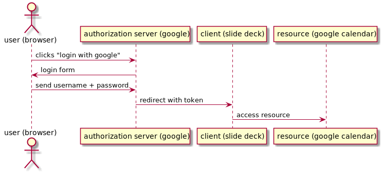
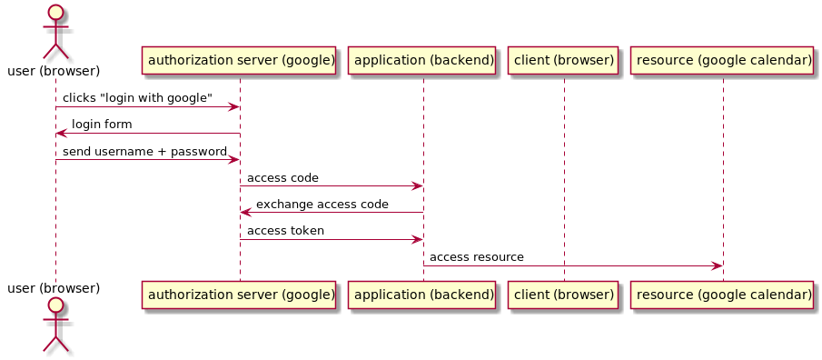

:customcss: custom.css

= OAuth 2.0 workshop

[border=none]
image:https://cache.willhaben.at/img/willhaben-style/wh_Logo_RGB.svg[willhaben,400]

== About me

Matthias Kausl

Team lead and Java dev @ willhaben

blog: https://tech.willhaben.at/[tech.willhaben.at]

twitter: @willhabentech

== Motivation

* currently implementing OAuth 2.0 @willhaben
* not everyone had knowledge about it
* lots of frameworks that implement OAuth 2.0
* look "under the hood" to understand it better

== Goal

understand how these work

image:login-buttons.png[login]

== Agenda

* Mini talk about OAuth 2.0
* Coding challenge

== What is OAuth 2.0?

OAuth 2.0 is a *authorization framework*

It defines how a *client* application can +
obtain *authorization* from a *user* + 
to access a *resource* on the users behalf

== Vocabulary
[cols="1,6"]
|===
| *authorization* | give user access to a resource +
 *What is allowed?*
| *authentication* | validate that the user is who he claims +
 *Who is the user?* +
(OAuth 2.0 does not address this)
|===

see also https://www.okta.com/identity-101/authentication-vs-authorization/[authentication vs authorization]

== Vocabulary
[cols="1,6"]
|===
| *client* | any application +
e.g. desktop or web app (with server backend), single page app (without server), ...
| *resource* | something the user has access to +
e.g. REST API accessing your google calendar
| *access token* 
| token representing the authorization + 
issued by the authorization server
|===

== Vocabulary
[cols="1,6"]
|===
| *access token*
| token representing the authorization +
issued by the authorization server
|===

== Example: access google calendar

*This slide deck* (the client) +
wants to access +
*my google calendar* (resource).

It needs to *obtain authorization* from googles *authorization server*.

OAuth 2.0 defines how to do this.

=== Example

=== Example flow
[source]
----
https://accounts.google.com/o/oauth2/v2/auth // <1>
?client_id=1010832371207... // <2>
&redirect_uri=http://url-of-slidedeck.com/... // <3>
&response_type=token // <4>
&scope=https://www.googleapis.com/auth/calendar.readonly // <5>
----
<1> Authorization server URL
<2> Client ID specific to the authorization server
<3> URL the authorization server redirects back to
<4> Which flow (grant type) to use
<5> What the client wants to access

=== Example

https://accounts.google.com/o/oauth2/v2/auth?client_id=1010832371207-6lg7vjf685teluei2aalmmudsm7a0m5j.apps.googleusercontent.com&redirect_uri=http://localhost&response_type=token&scope=https://www.googleapis.com/auth/calendar.readonly[Login with google]

== Grant types

The steps needed to get the access token are defined in so called *grant types*.

In this workshop we will look at two grant types:

* Implicit (google calendar example)
* Authorization Code

== Lets start coding

You need

* your laptop (any editor, IDE, ...)
* internet access + a browser
* a local webserver serving from port 8080 (`http://locahost:8080`) 
* a tool for making HTTP requests (curl, postman, ...)

== Task 1 - Implicit Flow

https://s3.eu-central-1.amazonaws.com/wh-oauth-workshop/tasks/task1.html

== Solution 1

=== Query Parameters
|===

|`client_id` | `3can53th3tlmsnhcn1buji30i8`

|`redirect_uri` | `http://localhost:8080/callback`

|`scope` | openid

|`response_type` | token

|===

=== Request

 https://.../oauth2/authorize
 ?response_type=token
 &redirect_uri=http://localhost:8080/callback
 &scope=openid
 &client_id=3can53th3tlmsnhcn1buji30i8

== Task 2 - Authorization Code Flow

https://s3.eu-central-1.amazonaws.com/wh-oauth-workshop/tasks/task2.html

== Solution 2

=== Query Parameters

|===

|`client_id` | `5vkkniseds4i1s4pst0uoe280u`

|`redirect_uri` | `http://localhost:8080/callback`

|`scope` |  `openid devjourfix.willhaben.test/devjourfix`

|`response_type` | code |

|===

=== Request

 https://.../login
 ?response_type=code
 &redirect_uri=http://localhost:8080/callback
 &scope=openid+devjourfix.willhaben.test/devjourfix+devjourfix.willhaben.test/final
 &client_id=5vkkniseds4i1s4pst0uoe280u">

=== Request 2

 POST
 https://devjourfix-willhaben-test.auth.eu-central-1.amazoncognito.com/oauth2/token

 Headers
 Content-Type: 'application/x-www-form-urlencoded'
 Authorization: Base64Encode(client_id + ':' + client_secret)

 code=xxxxx
 grant_type=authorization_code
 client_id=5vkkniseds4i1s4pst0uoe280u
 redirect_uri=http://localhost:8080/callback

== Task 3 - Refresh token

https://s3.eu-central-1.amazonaws.com/wh-oauth-workshop/tasks/task3.html

== Solution 3

 POST
 https://devjourfix-willhaben-test.auth.eu-central-1.amazoncognito.com/oauth2/token

 Headers
 Content-Type: 'application/x-www-form-urlencoded'
 Authorization: Base64Encode(client_id + ':' + client_secret)

 refresh_token=xxxxx
 grant_type=refresh_token
 client_id=5vkkniseds4i1s4pst0uoe280u

== Task 4 - Token validation

https://s3.eu-central-1.amazonaws.com/wh-oauth-workshop/tasks/task4.html